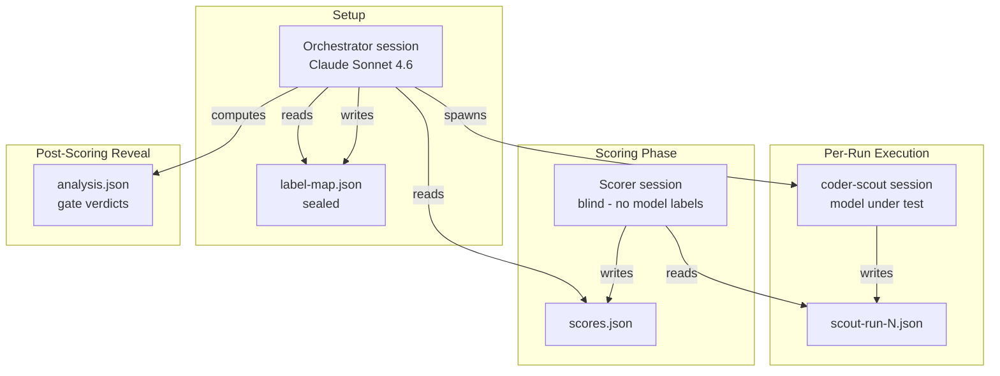

# Methodology

## Experiment Setup

These experiments use default Goose sessions: no recipe, no multi-agent pipeline. The goal was to test alternate models for the `coder-scout` agent role in isolation, outside of any orchestrated workflow.

*Figure 1: Session layout for exp3 and exp4. Each run is a standalone Goose session using the coder-scout prompt with the model under test. The label-map.json file is sealed before any session is spawned, ensuring the scorer session operates without knowledge of model identities. Model identity is revealed only after all scores are recorded.*

- **Orchestrator session:** Claude Sonnet 4.6 via GCP Vertex AI. Manages the experiment loop: writes label-map.json, spawns coder-scout sessions sequentially, records latency, and computes results after scoring.
- **coder-scout session:** Model under test. Receives the coder-scout prompt (adapted from `~/.claude/agents/coder-scout.md`) and a fixed target issue. Produces a research handoff JSON.
- **Scorer session:** Separate blind Goose session. Receives run files with numeric labels only (no model names). Applies the 8-criterion rubric and writes scores.json.

## Delegate Models

### Experiment 3 (Discovery Phase)

Baseline and three candidate models, each tested n=5:

- **Claude Haiku 4.5 (baseline):** Anthropic, commercial API
- **Qwen3 Coder:** Alibaba Qwen, open-weight (7B), via OpenRouter
- **Gemini 3 Flash:** Google, commercial API
- **Devstral 2512:** Mistral AI, open-weight (7B), via HuggingFace

### Experiment 4 (Validation Phase)

Baseline reused (exp3 runs 1-5) and four new candidates, each n=5 (DeepSeek n=3 due to failures; Mistral n=5 valid from 8 attempts):

- **Claude Haiku 4.5 (baseline):** Reused from exp3 (mean=5.8)
- **MiniMax M2.5:** Chinese Minimax, open-weight via OpenRouter
- **DeepSeek V3.2:** Chinese DeepSeek, commercial API
- **Kimi K2.5:** Chinese Moonshot, commercial API
- **Mistral Small 4 (`mistral-small-2603`):** Mistral AI, commercial API via OpenRouter

## Blinding Procedure

1. **Label-map creation:** Before any SCOUT delegate is spawned, a label-map.json file is written: `{run_id: model_name}` (e.g., `{"001": "claude-haiku-4-5", "002": "qwen3-coder"}`). This file is sealed (version controlled but not revealed until after scoring).
2. **Scorer receives numeric labels only:** Scorer subagent receives run data with `run_id` (numeric), scores, timestamps, and error messages, but NO model names.
3. **Post-scoring reveal:** After all scoring is complete and recorded, label-map.json is published in data/{exp}/label-map.json. Scorer then reconciles their independent annotations with actual models.

## Session Configuration

- **Orchestrator session:** Claude Sonnet 4.6 (GCP Vertex AI), temperature 0.3
- **coder-scout sessions:** Model under test, temperature 0.5, extensions: developer, context7, brave_search
- **Scorer session:** Claude Sonnet 4.6 (GCP Vertex AI), temperature 0.3

## Scoring Rubric (C1-C8, Binary 0-1 per Criterion)

| Criterion | Meaning |
|-----------|---------|
| C1 | Correct problem decomposition: does the solution parse the task correctly? |
| C2 | Appropriate tool selection: are chosen tools and approaches suitable for the lens? |
| C3 | Valid syntax: do all code artifacts compile/execute without syntax errors? |
| C4 | Edge case handling: does the solution anticipate and handle boundary conditions? |
| C5 | Error handling: are exceptions, null checks, and error states properly handled? |
| C6 | No circular or redundant logic: is the code free of unnecessary repetition or cycles? |
| C7 | Architecture matches specification: does the design align with the stated requirements? |
| C8 | Code usability and clarity: is the code readable, well-named, and easy to understand? |

**Total score per run:** sum of C1-C8 (range 0-8).

## Gate Criteria (Non-Inferiority)

A candidate passes if ALL four gates are satisfied:

1. **Mean threshold:** candidate_mean > 5.3 (must exceed floor)
2. **Floor criterion:** min(candidate_scores) >= 5 (no single run below 5)
3. **Completeness error rate:** (failed_runs / total_attempted) <= 0.2 (at most 1 failure per 5 runs)
4. **Non-inferiority:** Mann-Whitney U test p > 0.05 (cannot reject equality with baseline) AND rank-biserial r >= -0.5 (effect size acceptable)

**Verdict:** PASS if all four gates met; FAIL otherwise.

## Statistical Test: Mann-Whitney U

- **Null hypothesis:** Candidate and baseline populations have the same distribution.
- **Alternative hypothesis (two-tailed):** Distributions differ.
- **Test:** Mann-Whitney U with exact permutation (n=5 per group, all permutations enumerated).
- **Alpha:** 0.05 (critical p-value).
- **Effect size:** Rank-biserial correlation r (reported alongside p).
- **Interpretation:** p > 0.05 means we fail to reject the null hypothesis (no significant difference from baseline); candidate is non-inferior.

## Limitations

1. **Sample size (n=5):** Underpowered for strong statistical inference. Power analysis indicates ~40% power to detect a 0.5 SD effect size at alpha=0.05. Results are indicative, not definitive; confidence intervals are wide.

2. **No raw conversation logs:** Goose session records (full conversational trace, token counts per turn, model-specific generation parameters) are not included. Only scored outputs and summary handoff metadata are available. Reproducibility is limited to session-level replay; model-level debugging is not possible without logs.

3. **Qwen3 Coder exclusion (exp3):** Seven session attempts produced zero output files: the model consistently exhausted the delegate action limit before writing its handoff JSON. Reproduced with the same prompt on 2026-03-16, confirming this is a persistent model behavior failure, not a transient infrastructure or routing issue. Excluded from quantitative comparison; classified as "0/7 valid runs."

4. **DeepSeek V3.2 partial sample (exp4):** Two of five runs (27, 30) failed with infrastructure errors. Only n=3 valid runs for DeepSeek. This increases uncertainty in the mean and p-value. Reported with explicit caveat.

5. **Single orchestrator session:** All runs used Claude Sonnet 4.6. Generalization to other orchestrator models is unknown.

6. **Baseline reuse in exp4:** Exp4 reuses exp3's baseline scores (runs 1-5) rather than collecting new exp4 runs. This preserves baseline reproducibility but introduces potential confounding (exp3 and exp4 context may differ).

7. **Temperature setting:** All runs at temperature 0.3. Sensitivity to temperature variations is not explored.

## Reproducibility

To reproduce these experiments:

1. **Install Goose** with the version noted in [Software Versions](../README.md#software-versions) (README.md).
2. **Copy the coder-scout prompt** from `~/.claude/agents/coder-scout.md` into your session instructions.
3. **Prepare label-map:** Write a `label-map.json` file with run IDs and model assignments before starting any sessions.
4. **Run coder-scout sessions:** Start a new default Goose session per run, using the coder-scout prompt and the model under test (developer, context7, brave_search extensions). Record session IDs and handoff outputs.
5. **Run scorer:** Start a separate blind Goose session that receives run files with numeric labels only (no model names). Scorer applies C1-C8 rubric and writes scores.json.
6. **Post-scoring reveal:** Publish label-map.json; reconcile scores with model identities.
7. **Statistical analysis:** Compute means, error rates, Mann-Whitney U p-values, and apply gate criteria (see gate section above).

## References

- Mann-Whitney U test: https://en.wikipedia.org/wiki/Mann%E2%80%93Whitney_U_test
- Rank-biserial correlation: https://en.wikipedia.org/wiki/Rank_correlation#Rank-biserial_correlation
- Goose agent framework: https://github.com/block/goose
