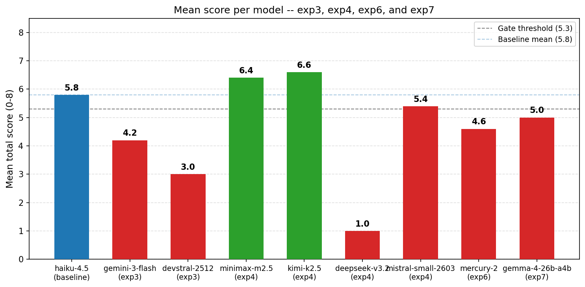
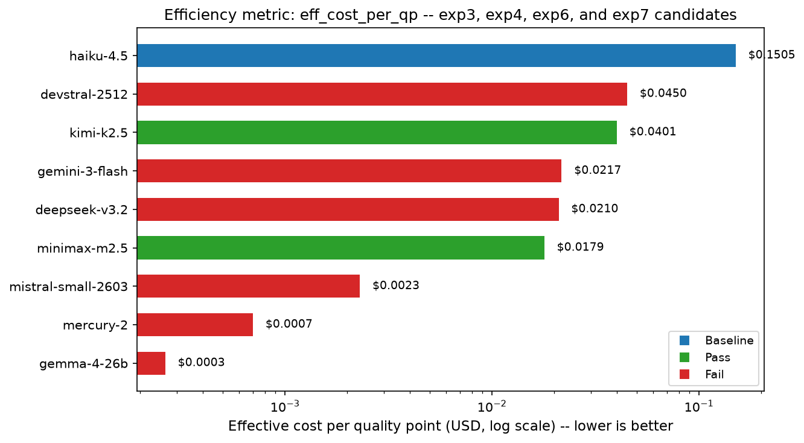

<div align="center">

# llm-agent-experiments

[](https://doi.org/10.5281/zenodo.19056876)
[](LICENSE)
[](experiments/)
[](experiments/)

Deploying LLM agents at scale demands cost-effective model selection for each role in a multi-agent pipeline. We investigate whether open-weight models can serve as drop-in replacements for a proprietary baseline (Claude Haiku 4.5) in a specialized research synthesis agent role, using a pre-registered, blinded 8-criterion binary rubric across two sequential experiments (7 models, 33 runs; approximately 4-5 runs per model (except DeepSeek V3.2: 3 valid due to infrastructure failures)). Candidate quality was evaluated against a Mann-Whitney U non-inferiority criterion (alpha=0.05). Two candidates meet all non-inferiority thresholds: Kimi K2.5 (mean 6.6/8) and MiniMax M2.5 (mean 6.4/8; API cost 87% lower than the baseline per run). Two candidates fail on reliability: Qwen3 Coder (0 of 7 valid runs) and DeepSeek V3.2 (40% error rate); Gemini 3 Flash, Devstral 2512, and Mistral Small 2603 also fail to meet quality thresholds. Results are limited to a single task type and pipeline configuration; generalizability to other agent roles requires further study. The evaluation protocol is released as a reusable template for role-level model substitution assessments in multi-agent systems.

Exp5 and exp6 extend coverage to all 7 pipeline roles. Exp6 evaluates `inception/mercury-2` (n=5 per role, 35 runs) and finds 100% correctness on BUILD, FIXER, CHECK, REVIEW, and QA, with a full pipeline wall time of 23s and $0.0124/pipeline cost.

Supplementary materials for [Orchestrating AI Agents: Sub-Agent Architecture](https://clouatre.ca/posts/orchestrating-ai-agents-subagent-architecture/).

</div>

## The Question

Can open-weight models serve as drop-in replacements for a proprietary LLM baseline in a specialized research synthesis role within a multi-agent pipeline, at lower API cost, without degrading output quality as measured by a pre-registered, blinded rubric under non-inferiority criteria?

## Scoring Rubric

| Criterion | Description |
|-----------|-------------|
| C1 | Correct problem decomposition |
| C2 | Appropriate tool selection |
| C3 | Cargo.toml absence explicitly noted |
| C4 | Hybrid vs. full-migration tradeoff articulated with codebase evidence |
| C5 | At least 2 specific patterns identified as requiring multi-line detection |
| C6 | Data-flow/taint tracking gap noted as unsolved by tree-sitter alone |
| C7 | Non-obvious architectural implication requiring code synthesis |
| C8 | Valid JSON output per handoff schema |

*Table 1: Eight-criterion binary scoring rubric (0-8 total). Rubric locked before any delegates were spawned. C3 definition was refined between exp3 and exp4 (exp3 C3: "Tree-sitter dependency absent from Cargo.toml"; exp4 C3: "Cargo.toml absence explicitly noted by the delegate"). Exp3 scores were not rescored under the updated definition; reported means reflect the rubric version in effect at time of scoring.*

## Results

| Model | n | Mean | Error rate | Verdict |
|-------|---|------|------------|---------|
| Claude Haiku 4.5 | 5 | 5.8 | 0.0 | baseline |
| Kimi K2.5 | 5 | 6.6 | 0.0 | pass |
| MiniMax M2.5 | 5 | 6.4 | 0.0 | pass |
| Mistral Small 2603 | 5 | 5.4 | 0.375 | fail |
| Gemini 3 Flash | 5 | 4.2 | 0.0 | fail |
| Devstral 2512 | 5 | 3.0 | 0.0 | fail |
| DeepSeek V3.2 | 3 | 1.0 | 0.4 | fail |
| Qwen3 Coder | 0 | n/a | 1.0 | excluded (0/7 valid runs) |
| Mercury 2 | 5 | 4.6 | 0.0 | fail |

*Table 2: Per-model results. Baseline first, then sorted by mean score descending. Error rate = fraction of runs that failed to produce valid output. Exp3 = discovery round (Haiku 4.5, Qwen3 Coder, Gemini 3 Flash, Devstral 2512); exp4 = validation round (MiniMax M2.5, DeepSeek V3.2, Kimi K2.5, Mistral Small 2603); exp6 = Mercury 2 (frontmatter patch task, same 8-criterion rubric). Full data in experiments/. Mann-Whitney U p-values in analysis.json. Verdict requires passing all four gates: mean > 5.3, min score >= 5, n_valid >= 5, and Mann-Whitney non-inferiority (p >= 0.05 vs baseline). A model can fail despite a mean above the threshold if any other gate fails (e.g., Mistral Small 2603: mean=5.4 passes gate 1 but min score=4 fails gate 2).*

### Mean Score



*Figure 1: Mean total score per model across exp3 (discovery) and exp4 (validation). Blue = baseline, red = fail, green = pass. Gate threshold (5.3) and baseline mean (5.8) shown as dashed lines. Qwen3 Coder excluded (0 valid runs after 7 attempts). DeepSeek V3.2: n=3 valid runs, 40% error rate.*

Cost and token efficiency data are in `efficiency.json` within each experiment directory. Costs are computed from session token counts at 2026-02-25 pricing; see `DATA_DICTIONARY.md` for schema details.

### Criterion Pass Rates


*Figure 2: Pass rate per criterion (C1-C8) for all seven evaluated models across exp3 and exp4. Values are the fraction of valid runs satisfying each binary criterion (0.0-1.0). Row order: baseline, passing candidates, failing candidates.*

### Cost vs. Quality


*Figure 3: Quality score (mean total, 0-8) vs. estimated cost per valid run (USD, log scale). Horizontal dashed lines mark the gate threshold (5.3) and Haiku-4.5 baseline mean (5.8). Green circles = passing candidates; red crosses = failing candidates; blue diamond = baseline.*

### Efficiency Metrics

Composite metric: `eff_cost_per_qp = cost_per_run / (mean_score * reliability)`. Lower is better. Penalizes models that are expensive, unreliable, or low-scoring. `cost_per_run` uses accumulated session tokens. `reliability = n_valid / sum_of_attempt_numbers_per_run`.

| Model | Score | Cost/Run | Reliability | Eff. $/QP | Wall Time | Verdict |
|-------|-------|----------|-------------|-----------|-----------|---------|
| Mistral Small 2603 | 5.4 | $0.008 | 0.625 | **$0.002** | 1.8m | fail |
| MiniMax M2.5 | 6.4 | $0.115 | 1.000 | $0.018 | 5.1m | pass |
| DeepSeek V3.2 | 1.0 | $0.007 | 0.333 | $0.021 | 2.1m | fail |
| Gemini 3 Flash | 4.2 | $0.057 | 0.625 | $0.022 | 2.7m | fail |
| Kimi K2.5 | 6.6 | $0.221 | 0.833 | $0.040 | 11.6m | pass |
| Devstral 2512 | 3.0 | $0.113 | 0.833 | $0.045 | 2.6m | fail |
| Haiku 4.5 | 5.8 | $0.873 | 1.000 | $0.150 | 2.8m | baseline |
| Mercury 2 (SCOUT) | 4.6 | $0.003 | 1.000 | $0.001 | 0.1m | fail |

*Table 3: Composite efficiency metric (eff_cost_per_qp) per model. Sort order: ascending eff_cost_per_qp. Qwen3 Coder omitted (0 valid runs; metric undefined). DeepSeek V3.2 included for completeness but fails all gates. Mercury 2 cost and wall time reflect SCOUT role only (exp6).*

DeepSeek V3.2 ranks 2nd by this metric but fails all gates; eff_cost_per_qp is not a valid ranking signal for models that do not pass. Among passing candidates, MiniMax M2.5 ($0.018/QP) is 2x more cost-effective per quality point than Kimi K2.5 ($0.040/QP). Wall time is reported separately and is not folded into the composite.

Qwen3 Coder is omitted (0 valid runs; metric is undefined).



*Figure 4: Effective cost per quality point (eff_cost_per_qp) for all models with valid scores. Lower is better. Green = pass, red = fail, blue = baseline. Sort order: ascending eff_cost_per_qp. DeepSeek V3.2 ranks deceptively well due to near-zero cost and score=1; it fails all quality gates.*

## Repository Structure

```
llm-agent-experiments/
  README.md
  METHODOLOGY.md
  DATA_DICTIONARY.md
  CITATION.cff
  LICENSE
  recipe/
    goose-coder.yaml
  figures/
    criterion-heatmap.png
    cost-quality-scatter.png
  experiments/
    exp3-model-comparison/
      README.md
      protocol.md         # pre-registered, locked before run 1
      rubric.md           # 8-criterion binary scoring guide
      runner-prompt.md
      scorer-prompt.md
      analysis.json       # gate results, Mann-Whitney stats
      scores.json         # per-run criterion scores (blinded)
      efficiency.json     # token counts, costs, latency
      label-map.json      # run_id -> model name (revealed post-scoring)
      latency-log.jsonl   # wall-clock timestamps per run
      sessions/           # 15 SCOUT handoff JSONs (runs 01-05, 11-20)
    exp4-model-comparison-r2/
      README.md
      protocol.md
      rubric.md           # identical to exp3/rubric.md
      runner-prompt.md
      scorer-prompt.md
      analysis.json
      scores.json
      efficiency.json
      label-map.json
      latency-log.jsonl
      sessions/           # 13 SCOUT handoff JSONs (runs 21-35, minus 27/30)
    exp5-role-evaluation/
      README.md
      protocol.md         # task description, model/temperature specs, scoring method
      METHODOLOGY.md      # n=1 design rationale, notes semantics, SCOUT caveat
      sessions/           # 21 delegate handoff JSONs (7 roles x 3 models)
        label-map.json    # run_id -> model name
    exp6-mercury2-evaluation/
      README.md
      protocol.md         # Mercury 2 evaluation design, task, temperatures
      rubric.md           # C1-C8 adapted for frontmatter task
      runner-prompts.md   # exact prompts per role
      scores.json         # SCOUT C1-C8 scores + other roles binary correct/incorrect
      latency-log.jsonl   # per-run token counts and wall times
      sessions/           # 35 delegate handoff JSONs (7 roles x 5 runs)
```

*Code Snippet 1: Repository directory tree.*

## Inspecting the Data

```bash
# View scores for all runs in exp4
jq '.runs | to_entries[] | {run: .key, total: .value.total}' \
  experiments/exp4-model-comparison-r2/scores.json

# Reveal model assignments after scoring
jq . experiments/exp4-model-comparison-r2/label-map.json

# Compare mean scores across models
jq '.candidates | to_entries[] | {model: .key, mean: .value.summary.mean, verdict: .value.verdict}' \
  experiments/exp4-model-comparison-r2/analysis.json

# Count sessions per experiment
ls experiments/exp3-model-comparison/sessions/ | wc -l
ls experiments/exp4-model-comparison-r2/sessions/ | wc -l
ls experiments/exp5-role-evaluation/sessions/ | wc -l
ls experiments/exp6-mercury2-evaluation/sessions/ | wc -l

# Read a SCOUT handoff (session file)
jq '{lens, recommendation, approaches: [.approaches[].name]}' \
  experiments/exp3-model-comparison/sessions/scout-run-03.json
```

*Code Snippet 2: Example jq queries for exploring the dataset.*

## Data Files

### analysis.json
Experiment metadata, baseline summary, per-candidate verdict structure with scores, gates (pass/fail), statistical test results, and overall recommendation.

### scores.json
Per-run array of criterion scores (C1-C8, each 0-1 binary), total (0-8), scorer annotations, and timestamp.

### efficiency.json
Per-model pricing (USD per MCT hour), token counts, and interpolated cost per run.

### label-map.json
JSON object mapping `run_id` (string) to model name. Written before any SCOUT spawning; scorer receives numeric labels only.

### latency-log.jsonl
One JSON per line: `{run_id, start_timestamp, end_timestamp}` in ISO 8601 format.

### sessions/scout-run-N.json
SCOUT handoff schema (goose-coder v4.2.1): `session_id`, `lens`, `relevant_files`, `conventions`, `patterns`, `related_issues`, `constraints`, `test_coverage`, `library_findings`, `approaches`, `recommendation`.

## Session Gaps

**Exp 3 runs 06-10:** Qwen3 Coder produced zero valid outputs after 7 attempts. The model consistently exhausted its action budget before writing the handoff JSON. Reproduced on 2026-03-16 with the same prompt, confirming this is a persistent model behavior failure, not a transient infrastructure issue. Marked as excluded (0/7 valid runs).

**Exp 4 runs 27 and 30:** DeepSeek V3.2 failed to produce parseable JSON on those two attempts (infrastructure timeouts). Counted as errors in error_rate calculation (2 / 5 = 0.4).

## Raw Log Gap

Raw JSONL conversation logs (goose session records) are not included in this repository. The reference repository (prompt-repetition-experiments) includes them for exp1 and exp2; they were not captured in the pipeline for exp3 and exp4. This is documented as a limitation (see Limitations below).

## Reproducibility

All experiments used Goose 1.27.2 as the agent orchestrator. To reproduce:

1. Install Goose 1.27.2
2. Set orchestrator to Claude Sonnet 4.6 via GCP Vertex AI, temperature 0.3
3. Follow the protocol in `METHODOLOGY.md` for delegate spawning and blind scoring
4. Use the label-map.json to reveal model identities only after scoring is complete

## Software Versions

| Component | Version | Notes |
|-----------|---------|-------|
| Goose | 1.27.2 | Agent orchestrator |
| Python | 3.13.12 | Analysis scripts, runner machine |
| Orchestrator model | Claude Sonnet 4.6 | GCP Vertex AI, temp 0.3 |
| SCOUT delegate models | See exp3/exp4 protocol | Variable per experiment |

*Table 4: Software versions used across all experiments.*

## Impact

These experiments directly informed changes to the coder recipe. Following exp4 results and a parallel refactor of the `code-analyze` MCP server to reduce token overhead ([clouatre-labs/code-analyze-mcp#264](https://github.com/clouatre-labs/code-analyze-mcp/issues/264)), SCOUT was upgraded from Claude Haiku 4.5 to Claude Sonnet 4.6; the lower per-token cost of the compact MCP format made Sonnet viable at SCOUT's session length. The recipe was rewritten to define each agent role as a named subagent file, achieving cross-compatibility between Goose and Claude Code (see [blog post](https://clouatre.ca/posts/orchestrating-ai-agents-subagent-architecture/)). MiniMax M2.5 (exp4: mean 6.4/8, error rate 0.0) was adopted for GUARD with a reduced adversarial scope, replacing Haiku at lower cost.

Exp5 and exp6 extend the evaluation to all 7 pipeline roles. Exp5 (n=1, three models: Haiku 4.5, Mistral Small 2603, MiniMax M2.5) established that Mistral Small 2603 is turn-efficient on execution roles (GUARD, BUILD, FIXER, REVIEW, QA). Exp6 (n=5, Mercury 2) finds that Mercury 2 (a diffusion LLM) achieves 100% correctness on BUILD, FIXER, CHECK, REVIEW, and QA roles with 1.8-3.6s wall time per role and $0.0124/pipeline total cost, making it the fastest model evaluated. Mercury 2 GUARD shows an 80% pass rate (one false revise verdict in 5 runs). SCOUT remains on Claude Sonnet 4.6.

## Limitations

1. **Underpowered study design:** n=5 per model is insufficient for strong statistical power. Results are indicative, not definitive.
2. **No raw logs:** Conversation records (goose session JSONL) are absent; only scored outputs and handoff metadata are available.
3. **Qwen3 Coder exclusion:** Zero valid runs after 7 attempts; excluded from analysis. The model consistently exhausted its action budget before writing output; reproduced on 2026-03-16, confirming a persistent model behavior failure.
4. **DeepSeek V3.2 partial sample:** n=3 valid (2 of 5 runs failed); increases variance in comparison. p-value should be interpreted conservatively.
5. **Single orchestrator:** All runs used Claude Sonnet 4.6; generalization to other orchestrators unknown.

## Ethics Statement

This repository documents a research experiment conducted using commercial and open-weight large language models. The study was pre-registered (label-map.json sealed before scoring) to mitigate confirmation bias. Model names were withheld from the scorer until completion. All statistical tests were two-tailed with alpha=0.05. Findings are presented with limitations explicitly stated. No human participants were involved; no personal data was collected.

## Data Availability

This repository contains the complete dataset, methodology, and analysis code. All files are public under the Apache License 2.0. Supplementary materials include METHODOLOGY.md and the `recipe/goose-coder.yaml` file (the Goose coder recipe used as the target multi-agent workflow). The source orchestrator (Claude Sonnet 4.6, GCP Vertex AI) and SCOUT delegate models are noted for reference; SCOUT handoff JSONs are in the experiments/*/sessions/ directories.

## Funding and Conflict of Interest

This research was funded internally. The researchers have no competing financial interests. Claude Haiku 4.5 (the baseline) is a commercial model offered by Anthropic; the authors work with Anthropic technology in the goose framework context. Open-weight model comparisons are not endorsements, only technical evaluations.

## Citation

If you use this dataset or methodology, please cite:

```bibtex
@misc{clouatre2026orchestrating,
  title   = {Orchestrating AI Agents: A Subagent Architecture},
  author  = {Clouatre, Hugues},
  year    = {2026},
  doi     = {10.5281/zenodo.19056876},
  howpublished = {\url{https://clouatre.ca/posts/orchestrating-ai-agents-subagent-architecture/}},
  urldate = {2026-03-16},
  note    = {Supplementary materials: https://github.com/clouatre-labs/llm-agent-experiments}
}
```

See [CITATION.cff](CITATION.cff) for additional metadata.

## License

[Apache License 2.0](LICENSE)
