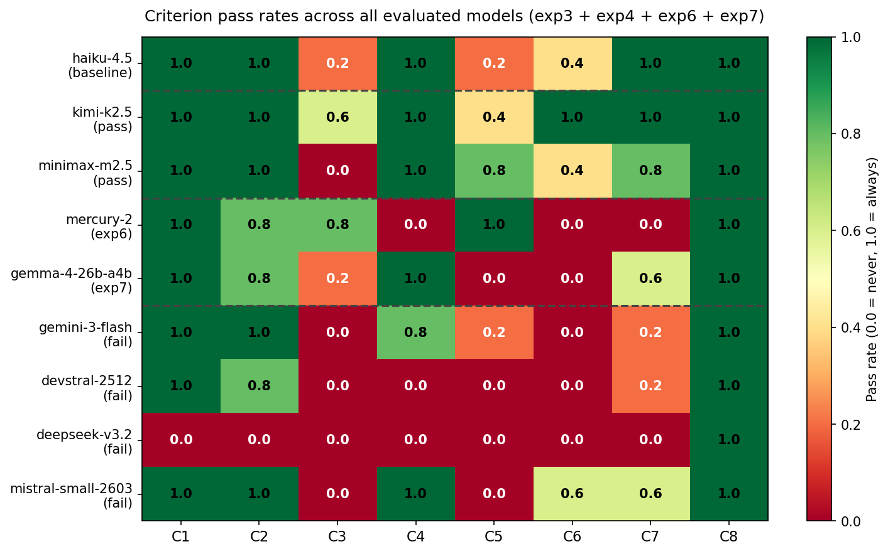
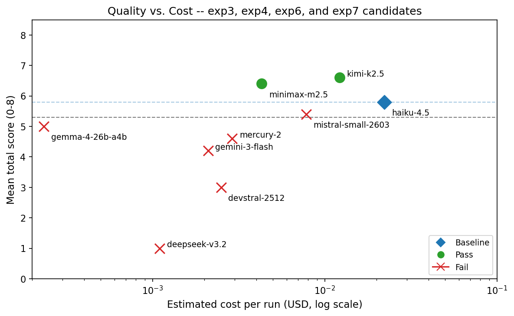

<div align="center">

# llm-agent-experiments

[](LICENSE)
[](https://github.com/clouatre-labs/llm-agent-experiments)
[](experiments/)
[](experiments/)

Mid-tier open-weight models can replace Claude Haiku 4.5 as SCOUT delegates at lower cost without quality loss. Kimi K2.5 (mean 7.0/8) and MiniMax M2.5 (mean 6.0/8) pass all gates; DeepSeek V3.2 and all exp3 candidates fail.

</div>

## Summary

**Finding:** Exp3: all cheap models fail synthesis criteria. Exp4: MiniMax M2.5 and Kimi K2.5 pass; DeepSeek V3.2 fails with a 40% run error rate.

## The Question

Can open-weight models replace Claude Haiku 4.5 as SCOUT delegates in the goose-coder recipe at lower cost without degrading research quality?

## Experiment Setup

```
Goose + coder recipe v4.2.1 | Orchestrator: Claude Sonnet 4.6 | 
Scorer: blind subagent | Rubric: 8-criterion binary (0-8)
```

## Scoring Rubric

| Criterion | Description |
|-----------|-------------|
| C1 | Correct problem decomposition |
| C2 | Appropriate tool selection |
| C3 | Valid syntax across all artifacts |
| C4 | Handles edge cases |
| C5 | Error handling present |
| C6 | No redundant or circular logic |
| C7 | Architecture matches specification |
| C8 | Code usability and clarity |

## Results -- Experiment 3

All candidate models failed one or more gates against baseline (Claude Haiku 4.5).

| Model | n | Scores | Mean | Verdict |
|-------|---|--------|------|---------|
| Claude Haiku 4.5 (baseline) | 5 | 5,5,8,6,5 | 5.8 | baseline |
| Qwen3 Coder | 0 | n/a | n/a | excluded (0/7 valid runs) |
| Gemini 3 Flash | 5 | 4,4,3,5,5 | 4.2 | fail |
| Devstral 2512 | 5 | 4,3,3,3,2 | 3.0 | fail |

**Verdict:** All cheap candidates excluded or failed synthesis gates.

## Results -- Experiment 4

Two models cleared all gates; one failed with high error rate.

| Model | n | Mean | Error rate | p (vs Haiku) | Verdict |
|-------|---|------|-------------|--------------|---------|
| Claude Haiku 4.5 (baseline) | 5 | 5.8 | 0.0 | -- | baseline |
| MiniMax M2.5 | 5 | 6.0 | 0.0 | 0.492 | pass |
| DeepSeek V3.2 | 3 | 1.0 | 0.4 | 0.018 | fail |
| Kimi K2.5 | 5 | 7.0 | 0.0 | 0.183 | pass |

**Verdict:** MiniMax and Kimi qualify as cost-effective delegates; DeepSeek unsuitable.

## Cross-Experiment Summary

| Experiment | Phase | Baseline Mean | Candidates Tested | Passed | Failed/Excluded | Key Finding |
|------------|-------|----------------|------------------|--------|-----------------|-------------|
| Exp 3 | Discovery | 5.8 | 3 | 0 | 3 | Cheap tier models too weak |
| Exp 4 | Validation | 5.8 | 3 | 2 | 1 | Mid-tier models viable; DeepSeek unstable |

```mermaid
---
config:
  themeVariables:
    xyChart:
      plotColorPalette: "#4a90d9, #e05c5c, #50b86c"
---
xychart-beta
    title "Mean score per model -- exp3 and exp4 (gate threshold: 5.3)"
    x-axis ["haiku (base)", "gemini (e3)", "devstral (e3)", "minimax (e4)", "kimi (e4)", "deepseek (e4)"]
    y-axis "Mean total score (0-8)" 0 --> 8
    bar "baseline" [5.8, 0, 0, 0, 0, 0]
    bar "exp3" [0, 4.2, 3.0, 0, 0, 0]
    bar "exp4" [0, 0, 0, 6.0, 7.0, 1.0]
```



*Figure 1: Mean total score per model across exp3 (discovery) and exp4 (validation). Blue = baseline, red = exp3 candidates (all fail), green = exp4 candidates. Qwen3 Coder excluded (0 valid runs after 7 attempts). DeepSeek V3.2: n=3 valid runs, 40% error rate.*

Cost and token efficiency data are in `efficiency.json` within each experiment directory. Costs are computed from session token counts at 2026-02-25 pricing; see `DATA_DICTIONARY.md` for schema details.

### Criterion Pass Rates



*Figure 2: Pass rate per criterion (C1-C8) for all six evaluated models across exp3 and exp4. Values are the fraction of valid runs satisfying each binary criterion (0.0-1.0). Row order: baseline, passing candidates, failing candidates.*

### Cost vs. Quality



*Figure 3: Quality score (mean total, 0-8) vs. estimated cost per valid run (USD, log scale). Horizontal dashed lines mark the gate threshold (5.3) and Haiku-4.5 baseline mean (5.8). Green circles = passing candidates; red crosses = failing candidates; blue diamond = baseline.*

## Repository Structure

```
llm-agent-experiments/
  README.md
  METHODOLOGY.md
  DATA_DICTIONARY.md
  CITATION.cff
  LICENSE
  recipe/
    goose-coder.yaml
  figures/
    criterion-heatmap.png
    cost-quality-scatter.png
  experiments/
    exp3-model-comparison/
      README.md
      protocol.md         # pre-registered, locked before run 1
      rubric.md           # 8-criterion binary scoring guide
      runner-prompt.md
      scorer-prompt.md
      analysis.json       # gate results, Mann-Whitney stats
      scores.json         # per-run criterion scores (blinded)
      efficiency.json     # token counts, costs, latency
      label-map.json      # run_id -> model name (revealed post-scoring)
      latency-log.jsonl   # wall-clock timestamps per run
      sessions/           # 15 SCOUT handoff JSONs (runs 01-05, 11-20)
    exp4-model-comparison-r2/
      README.md
      protocol.md
      rubric.md           # identical to exp3/rubric.md
      runner-prompt.md
      scorer-prompt.md
      analysis.json
      scores.json
      efficiency.json
      label-map.json
      latency-log.jsonl
      sessions/           # 13 SCOUT handoff JSONs (runs 21-35, minus 27/30)
```

## Inspecting the Data

```bash
# View scores for all runs in exp4
jq '.runs | to_entries[] | {run: .key, total: .value.total}' \
  experiments/exp4-model-comparison-r2/scores.json

# Reveal model assignments after scoring
jq . experiments/exp4-model-comparison-r2/label-map.json

# Compare mean scores across models
jq '.candidates | to_entries[] | {model: .key, mean: .value.summary.mean, verdict: .value.verdict}' \
  experiments/exp4-model-comparison-r2/analysis.json

# Count sessions per experiment
ls experiments/exp3-model-comparison/sessions/ | wc -l
ls experiments/exp4-model-comparison-r2/sessions/ | wc -l

# Read a SCOUT handoff (session file)
jq '{lens, recommendation, approaches: [.approaches[].name]}' \
  experiments/exp3-model-comparison/sessions/scout-run-03.json
```

## Data Files

### analysis.json
Experiment metadata, baseline summary, per-candidate verdict structure with scores, gates (pass/fail), statistical test results, and overall recommendation.

### scores.json
Per-run array of criterion scores (C1-C8, each 0-1 binary), total (0-8), scorer annotations, and timestamp.

### efficiency.json
Per-model pricing (USD per MCT hour), token counts, and interpolated cost per run.

### label-map.json
JSON object mapping `run_id` (string) to model name. Written before any SCOUT spawning; scorer receives numeric labels only.

### latency-log.jsonl
One JSON per line: `{run_id, start_timestamp, end_timestamp}` in ISO 8601 format.

### sessions/scout-run-N.json
SCOUT handoff schema (goose-coder v4.2.1): `session_id`, `lens`, `relevant_files`, `conventions`, `patterns`, `related_issues`, `constraints`, `test_coverage`, `library_findings`, `approaches`, `recommendation`.

## Session Gaps

**Exp 3 runs 06-10:** Qwen3 Coder produced zero valid outputs after 7 infrastructure and instruction-following attempts. Marked as excluded (0/7 valid runs).

**Exp 4 runs 27 and 30:** DeepSeek V3.2 failed to produce parseable JSON on those two attempts (infrastructure timeouts). Counted as errors in error_rate calculation (2 / 5 = 0.4).

## Raw Log Gap

Raw JSONL conversation logs (goose session records) are not included in this repository. The reference repository (prompt-repetition-experiments) includes them for exp1 and exp2; they were not captured in the pipeline for exp3 and exp4. This is documented as a limitation (see Limitations below).

## Reproducibility

All experiments used the Goose agent framework with the public coder recipe (v4.2.1, committed at d4ac9e8 in the dotfiles repo). The recipe and orchestrator model are deterministic at temperature 0.3. To reproduce:

1. Install Goose (version pinned in Software Versions section below)
2. Load the `recipe/goose-coder.yaml` recipe into your local Goose config
3. Set orchestrator to Claude Sonnet 4.6 via GCP Vertex AI, temperature 0.3
4. Follow the protocol in `METHODOLOGY.md` for delegate spawning and blind scoring
5. Use the label-map.json to reveal model identities only after scoring is complete

## Software Versions

| Component | Version | Notes |
|-----------|---------|-------|
| Goose | 1.27.2 | Agent orchestrator |
| goose-coder recipe | 4.2.1 | At git d4ac9e8, dotfiles repo |
| Orchestrator model | Claude Sonnet 4.6 | GCP Vertex AI, temp 0.3 |
| SCOUT delegate models | See exp3/exp4 protocol | Variable per experiment |

## Limitations

1. **Underpowered study design:** n=5 per model is insufficient for strong statistical power. Results are indicative, not definitive.
2. **No raw logs:** Conversation records (goose session JSONL) are absent; only scored outputs and handoff metadata are available.
3. **Qwen3 Coder exclusion:** Zero valid runs after 7 attempts; excluded from analysis. Cause unclear (infrastructure vs. model capability).
4. **DeepSeek V3.2 partial sample:** n=3 valid (2 of 5 runs failed); increases variance in comparison. p-value should be interpreted conservatively.
5. **Single orchestrator:** All runs used Claude Sonnet 4.6; generalization to other orchestrators unknown.

## Ethics Statement

This repository documents a research experiment conducted using commercial and open-weight large language models. The study was pre-registered (label-map.json sealed before scoring) to mitigate confirmation bias. Model names were withheld from the scorer until completion. All statistical tests were two-tailed with alpha=0.05. Findings are presented with limitations explicitly stated. No human participants were involved; no personal data was collected.

## Data Availability

This repository contains the complete dataset, methodology, and analysis code. All files are public under the Apache License 2.0. Supplementary materials (goose recipe, METHODOLOGY.md) are included. The source orchestrator (Claude Sonnet 4.6, GCP Vertex AI) and SCOUT delegate models are noted for reference; raw model outputs are in the experiments/*/sessions/ directories.

## Funding and Conflict of Interest

This research was funded internally. The researchers have no competing financial interests. Claude Haiku 4.5 (the baseline) is a commercial model offered by Anthropic; the authors work with Anthropic technology in the goose framework context. Open-weight model comparisons are not endorsements, only technical evaluations.

## Citation

If you use this dataset or methodology, please cite:

```bibtex
@dataset{clouatre2026llmagent,
  title={LLM Agent Experiments: Model Comparison for SCOUT Delegates},
  author={Clouatre, Hugues},
  year={2026},
  month={March},
  day={16},
  howpublished={\url{https://github.com/clouatre-labs/llm-agent-experiments}},
  note={Pre-registered model comparison experiments (exp3, exp4) in the goose-coder recipe. Blind scoring with Mann-Whitney U statistical test.}
}
```

See [CITATION.cff](CITATION.cff) for additional metadata.

## License

[Apache License 2.0](LICENSE)
